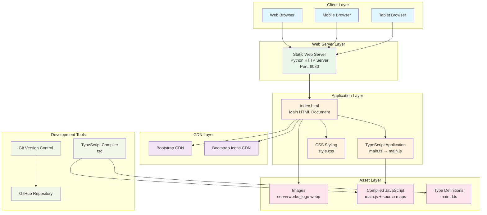
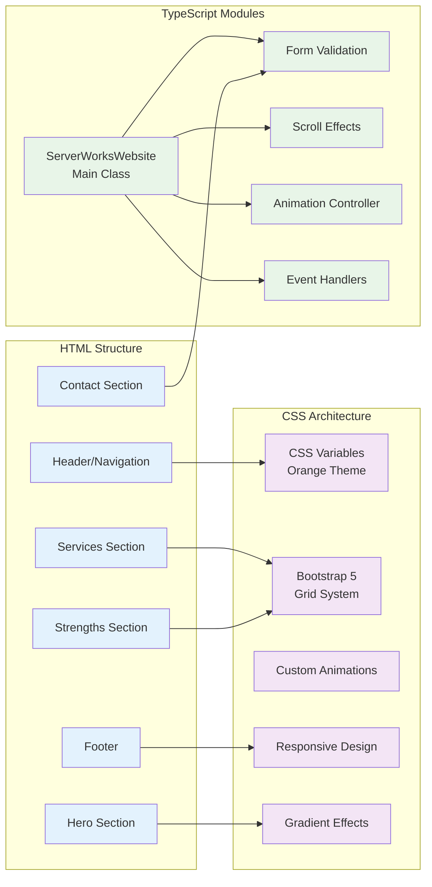
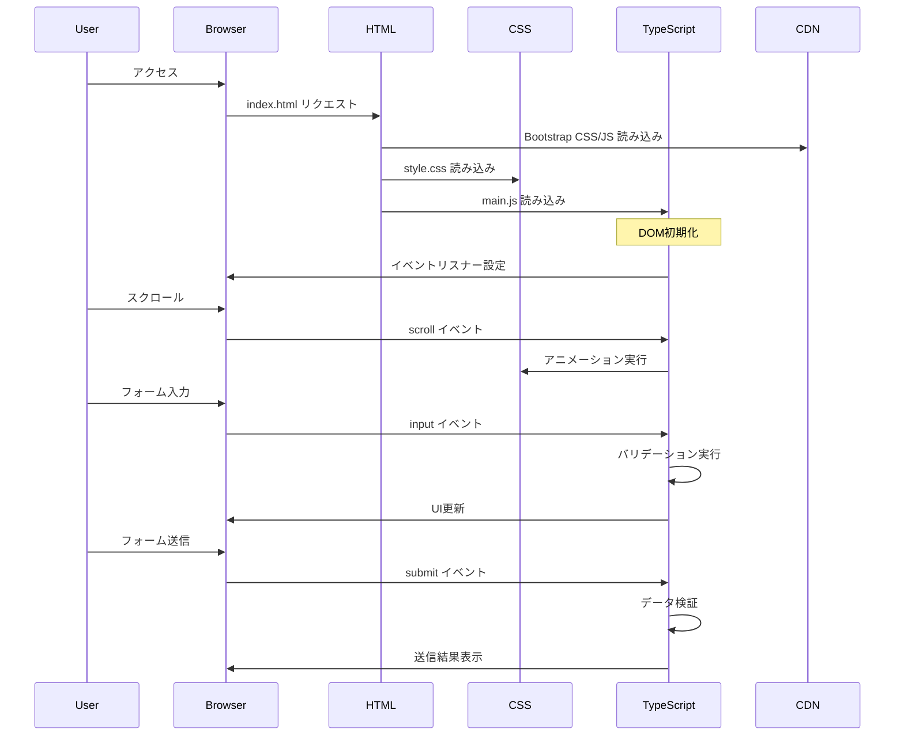
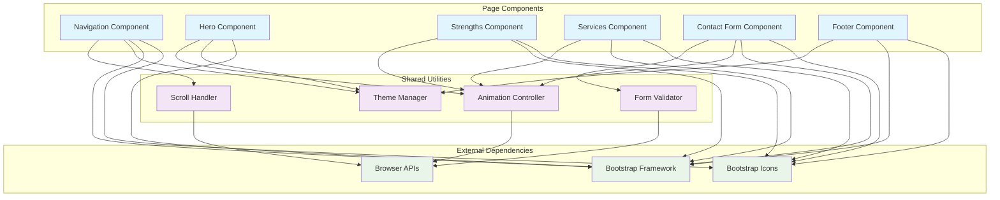
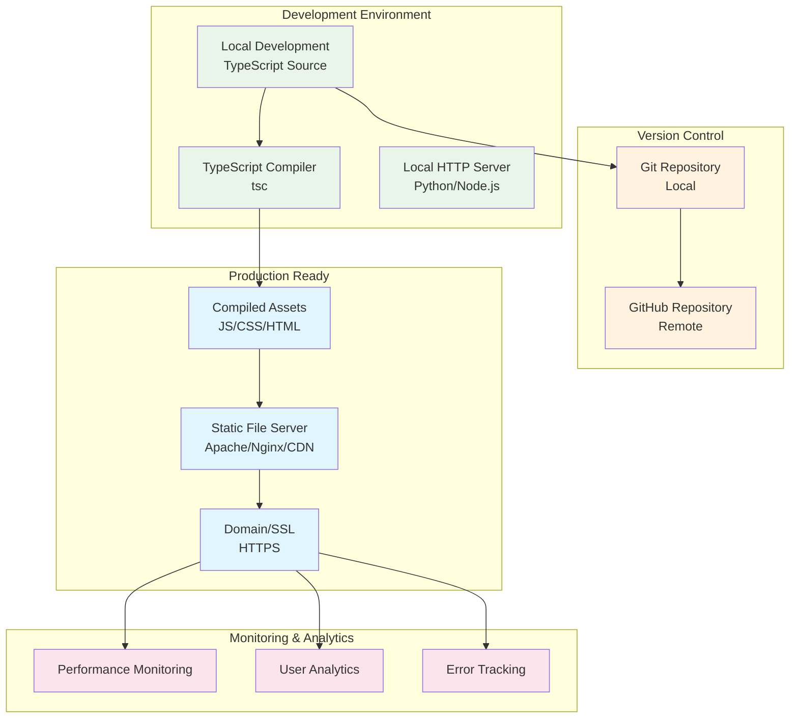
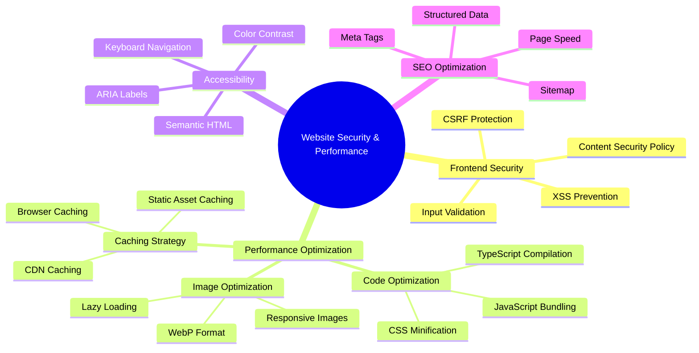
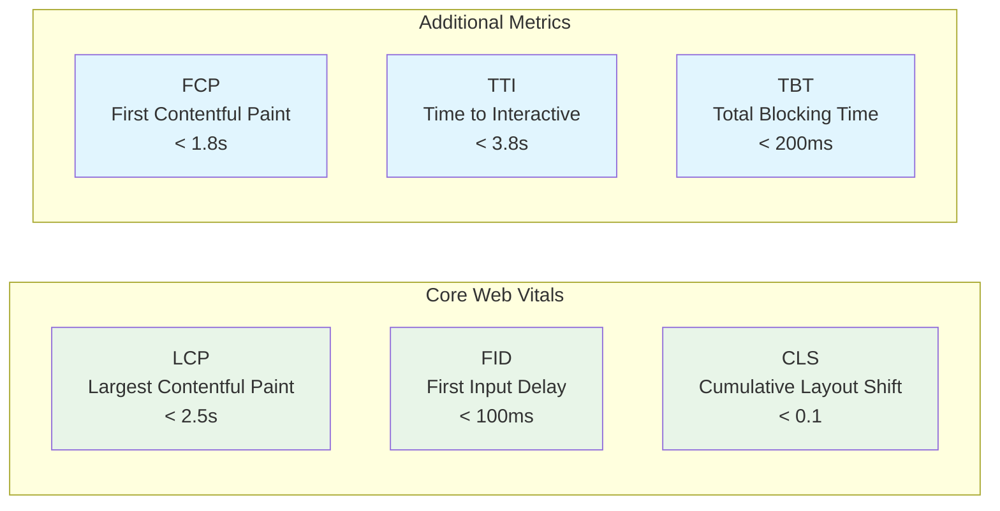

# サーバーワークス コーポレートWebサイト アーキテクチャ図

## システム全体構成

## フロントエンド アーキテクチャ詳細

## データフロー図

## コンポーネント構成図

## デプロイメント構成

## セキュリティ・パフォーマンス考慮事項

## 技術スタック詳細

| Layer | Technology | Version | Purpose |
|-------|------------|---------|---------|
| **Frontend Framework** | Bootstrap | 5.3.2 | レスポンシブUI |
| **Programming Language** | TypeScript | Latest | 型安全なJavaScript |
| **Styling** | CSS3 | - | カスタムスタイリング |
| **Icons** | Bootstrap Icons | 1.11.1 | アイコンライブラリ |
| **Build Tool** | TypeScript Compiler | Latest | JS変換・型チェック |
| **Version Control** | Git | - | ソースコード管理 |
| **Repository** | GitHub | - | リモートリポジトリ |
| **Development Server** | Python HTTP Server | 3.x | ローカル開発 |

## パフォーマンス指標

このアーキテクチャ図は、サーバーワークスのコーポレートWebサイトの技術構成、データフロー、コンポーネント関係、デプロイメント戦略を包括的に示しています。モダンなフロントエンド開発のベストプラクティスに従い、パフォーマンス、セキュリティ、アクセシビリティを考慮した設計となっています。
