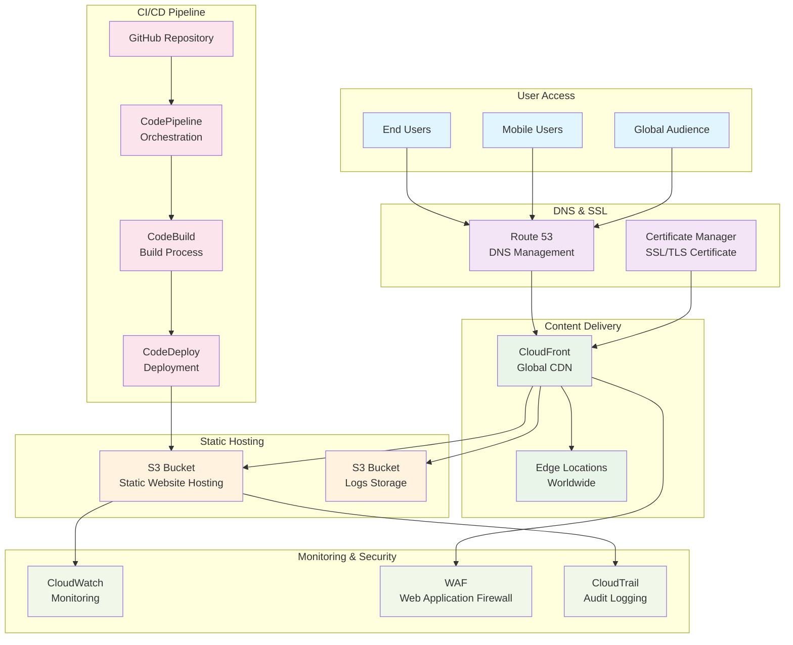

# サーバーワークス コーポレートサイト AWS移行計画

## 📋 移行概要

### 現在の構成
- **環境**: ローカル開発環境（Python HTTP Server）
- **構成**: 静的サイト（HTML + TypeScript + CSS）
- **依存関係**: CDN経由（Bootstrap、Bootstrap Icons）
- **リポジトリ**: GitHub（https://github.com/Morimasa-dev1/gen-ai-project-repo.git）

### 目標構成
- **ホスティング**: Amazon S3 + CloudFront
- **CI/CD**: AWS CodePipeline + CodeBuild
- **DNS**: Amazon Route 53
- **SSL/TLS**: AWS Certificate Manager
- **監視**: Amazon CloudWatch

## 🏗️ AWS アーキテクチャ設計

### 推奨構成：静的サイトホスティング



## 📅 移行計画（4フェーズ）

### Phase 1: 基盤構築（1-2日）

#### 1.1 S3バケット作成・設定
```bash
# メインサイト用バケット
aws s3 mb s3://serverworks-corporate-site --region ap-northeast-1

# ログ保存用バケット
aws s3 mb s3://serverworks-corporate-site-logs --region ap-northeast-1

# 静的ウェブサイトホスティング有効化
aws s3 website s3://serverworks-corporate-site \
  --index-document index.html \
  --error-document error.html
```

#### 1.2 バケットポリシー設定
```json
{
  "Version": "2012-10-17",
  "Statement": [
    {
      "Sid": "PublicReadGetObject",
      "Effect": "Allow",
      "Principal": "*",
      "Action": "s3:GetObject",
      "Resource": "arn:aws:s3:::serverworks-corporate-site/*"
    }
  ]
}
```

#### 1.3 CloudFront ディストリビューション作成
- **Origin**: S3バケット
- **Caching**: 最適化設定
- **Compression**: 有効
- **HTTP/2**: 有効

### Phase 2: SSL/DNS設定（1日）

#### 2.1 Certificate Manager
```bash
# SSL証明書リクエスト
aws acm request-certificate \
  --domain-name serverworks.example.com \
  --subject-alternative-names "*.serverworks.example.com" \
  --validation-method DNS \
  --region us-east-1
```

#### 2.2 Route 53設定
```bash
# ホストゾーン作成
aws route53 create-hosted-zone \
  --name serverworks.example.com \
  --caller-reference $(date +%s)

# Aレコード作成（CloudFrontエイリアス）
aws route53 change-resource-record-sets \
  --hosted-zone-id Z123456789 \
  --change-batch file://dns-record.json
```

### Phase 3: CI/CD構築（2-3日）

#### 3.1 CodeBuild プロジェクト作成
```yaml
# buildspec.yml
version: 0.2
phases:
  install:
    runtime-versions:
      nodejs: 18
  pre_build:
    commands:
      - echo Installing TypeScript compiler
      - npm install -g typescript
  build:
    commands:
      - echo Build started on `date`
      - echo Compiling TypeScript
      - tsc
      - echo Build completed on `date`
  post_build:
    commands:
      - echo Deploying to S3
artifacts:
  files:
    - '**/*'
  base-directory: '.'
```

#### 3.2 CodePipeline設定
```json
{
  "pipeline": {
    "name": "serverworks-corporate-site-pipeline",
    "roleArn": "arn:aws:iam::123456789012:role/CodePipelineRole",
    "stages": [
      {
        "name": "Source",
        "actions": [
          {
            "name": "SourceAction",
            "actionTypeId": {
              "category": "Source",
              "owner": "ThirdParty",
              "provider": "GitHub",
              "version": "1"
            },
            "configuration": {
              "Owner": "Morimasa-dev1",
              "Repo": "gen-ai-project-repo",
              "Branch": "main"
            }
          }
        ]
      },
      {
        "name": "Build",
        "actions": [
          {
            "name": "BuildAction",
            "actionTypeId": {
              "category": "Build",
              "owner": "AWS",
              "provider": "CodeBuild",
              "version": "1"
            }
          }
        ]
      },
      {
        "name": "Deploy",
        "actions": [
          {
            "name": "DeployAction",
            "actionTypeId": {
              "category": "Deploy",
              "owner": "AWS",
              "provider": "S3",
              "version": "1"
            }
          }
        ]
      }
    ]
  }
}
```

### Phase 4: 監視・セキュリティ強化（1-2日）

#### 4.1 CloudWatch設定
```bash
# カスタムメトリクス設定
aws logs create-log-group --log-group-name /aws/cloudfront/serverworks-corporate-site

# アラーム設定
aws cloudwatch put-metric-alarm \
  --alarm-name "HighErrorRate" \
  --alarm-description "High 4xx/5xx error rate" \
  --metric-name "4xxErrorRate" \
  --namespace "AWS/CloudFront" \
  --statistic Average \
  --period 300 \
  --threshold 5.0 \
  --comparison-operator GreaterThanThreshold
```

#### 4.2 WAF設定
```json
{
  "Name": "ServerWorksWebACL",
  "Scope": "CLOUDFRONT",
  "DefaultAction": {
    "Allow": {}
  },
  "Rules": [
    {
      "Name": "RateLimitRule",
      "Priority": 1,
      "Statement": {
        "RateBasedStatement": {
          "Limit": 2000,
          "AggregateKeyType": "IP"
        }
      },
      "Action": {
        "Block": {}
      }
    }
  ]
}
```

## 💰 コスト見積もり

### 月額コスト概算（東京リージョン）

| サービス | 使用量 | 月額コスト（USD） |
|---------|--------|------------------|
| **S3 Standard** | 1GB ストレージ | $0.025 |
| **CloudFront** | 100GB転送 | $8.50 |
| **Route 53** | 1ホストゾーン | $0.50 |
| **Certificate Manager** | 1証明書 | $0.00 |
| **CodePipeline** | 1パイプライン | $1.00 |
| **CodeBuild** | 10ビルド/月 | $0.50 |
| **CloudWatch** | 基本監視 | $2.00 |
| **WAF** | 1 Web ACL | $1.00 |
| **合計** | - | **約$13.75/月** |

### 初期構築コスト
- **設定作業**: 約4-6時間
- **テスト・検証**: 約2-3時間
- **ドキュメント作成**: 約1-2時間

## 🔧 実装手順

### Step 1: 事前準備
```bash
# AWS CLI設定確認
aws configure list

# 必要なIAMロール作成
aws iam create-role --role-name CodePipelineServiceRole \
  --assume-role-policy-document file://trust-policy.json
```

### Step 2: S3バケット作成・設定
```bash
# バケット作成
aws s3 mb s3://serverworks-corporate-site-$(date +%s) --region ap-northeast-1

# 現在のサイトファイルをアップロード
aws s3 sync . s3://serverworks-corporate-site-$(date +%s) \
  --exclude ".git/*" --exclude "*.md" --exclude "課題表.md"
```

### Step 3: CloudFront設定
```bash
# ディストリビューション作成
aws cloudfront create-distribution --distribution-config file://cloudfront-config.json
```

### Step 4: CI/CD構築
```bash
# CodeBuildプロジェクト作成
aws codebuild create-project --cli-input-json file://codebuild-project.json

# CodePipeline作成
aws codepipeline create-pipeline --cli-input-json file://pipeline-config.json
```

## 🛡️ セキュリティ考慮事項

### 1. アクセス制御
- **S3バケット**: パブリック読み取り専用
- **CloudFront**: OAI（Origin Access Identity）使用
- **IAMロール**: 最小権限の原則

### 2. データ保護
- **転送中**: HTTPS強制（HSTS有効）
- **保存時**: S3デフォルト暗号化
- **ログ**: CloudTrail有効化

### 3. 監視・アラート
- **アクセスログ**: CloudFront → S3
- **メトリクス**: CloudWatch監視
- **異常検知**: 自動アラート設定

## 📊 パフォーマンス最適化

### 1. CloudFront設定
```json
{
  "CacheBehaviors": [
    {
      "PathPattern": "*.css",
      "TTL": 86400,
      "Compress": true
    },
    {
      "PathPattern": "*.js",
      "TTL": 86400,
      "Compress": true
    },
    {
      "PathPattern": "*.webp",
      "TTL": 604800,
      "Compress": true
    }
  ]
}
```

### 2. S3最適化
- **Transfer Acceleration**: 有効化
- **Intelligent Tiering**: 自動階層化
- **Lifecycle Policy**: 古いバージョン削除

## 🔄 ロールバック戦略

### 1. 自動ロールバック
- **CodePipeline**: 失敗時の自動停止
- **CloudFormation**: スタック更新失敗時のロールバック

### 2. 手動ロールバック
```bash
# 前バージョンへの復元
aws s3 sync s3://serverworks-corporate-site-backup/ \
  s3://serverworks-corporate-site/

# CloudFrontキャッシュクリア
aws cloudfront create-invalidation \
  --distribution-id E123456789 \
  --paths "/*"
```

## 📈 運用・保守計画

### 1. 定期メンテナンス
- **月次**: コスト分析・最適化
- **四半期**: セキュリティ監査
- **年次**: アーキテクチャレビュー

### 2. 監視項目
- **可用性**: 99.9%以上
- **レスポンス時間**: 2秒以下
- **エラー率**: 1%以下

### 3. バックアップ戦略
- **S3バージョニング**: 有効化
- **クロスリージョンレプリケーション**: 災害対策
- **定期スナップショット**: 週次実行

この移行計画により、サーバーワークスのコーポレートサイトを高可用性・高パフォーマンス・低コストなAWS環境に移行できます。
